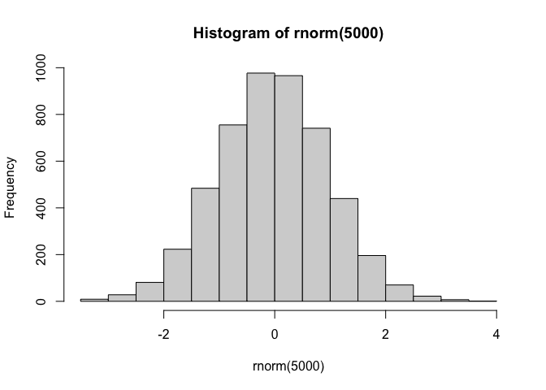
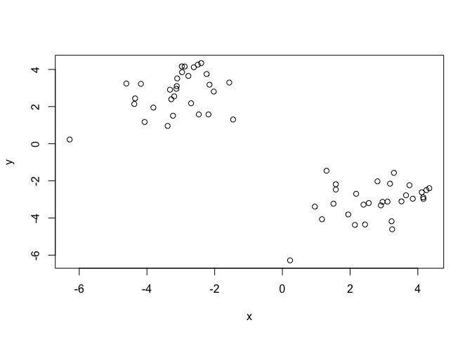
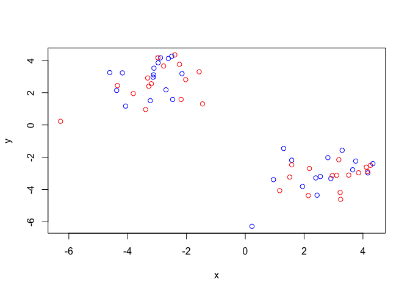
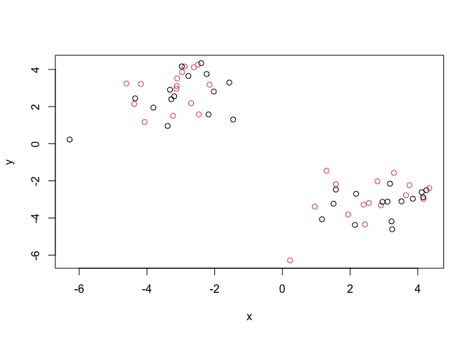
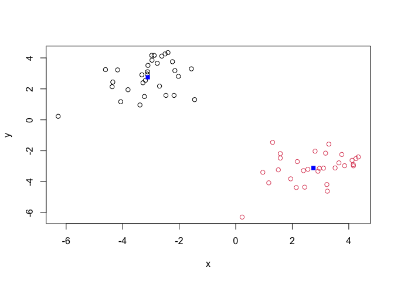
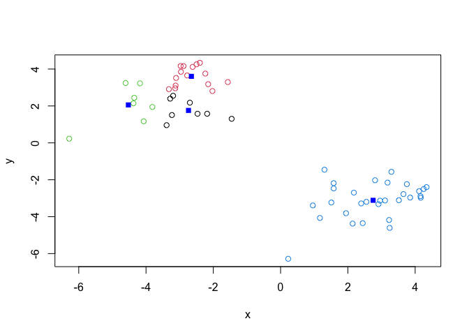
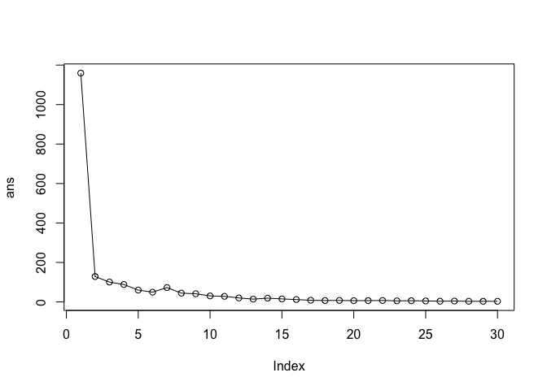
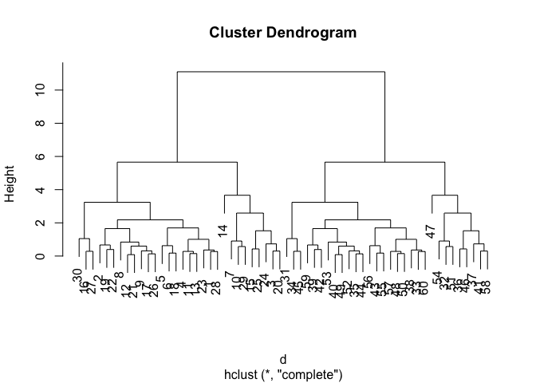
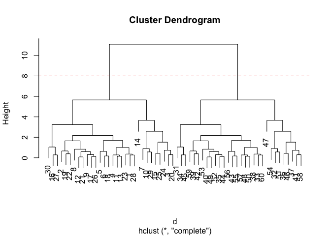
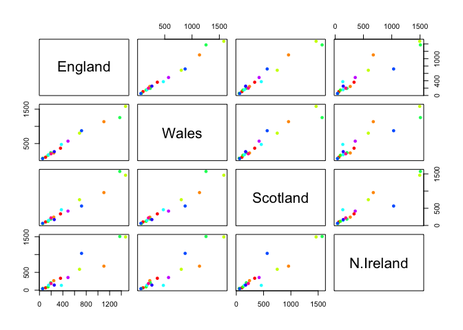

# Class07: Machine Learning 1
Yasmeen (PID: A18116120)

## Background

Today we will begin our exploration of some important machine learning
methods, namely **clustering** and **dimensionality reduction**

Let’s make uo some input data where we know what the natural “clusters”
are.

The function `rnorm()` can be useful here.

``` r
hist( rnorm(5000) )
```



> Q. Generate 30 random numbers centered at +3 and another 30 centered
> at -3

``` r
tmp <- c(rnorm(30, mean=3), rnorm(30, mean=-3) )

cbind(x=tmp, y=rev(tmp))
```

                   x          y
     [1,]  4.3281569 -3.7847412
     [2,]  2.6386252 -3.1490819
     [3,]  3.5315883 -4.6250202
     [4,]  4.2421958 -3.5806915
     [5,]  2.8602148 -4.5890395
     [6,]  2.7434366 -5.6525655
     [7,]  4.2506912 -1.5929864
     [8,]  1.7075976 -2.1766206
     [9,]  2.5866606 -2.6961642
    [10,]  1.4940640 -3.1192943
    [11,]  3.1889619 -1.7968049
    [12,]  1.7850776 -3.4714177
    [13,]  3.7588362 -3.6160230
    [14,]  4.0201291 -4.4573331
    [15,]  0.4487192 -4.1155486
    [16,]  1.7765600 -2.7530732
    [17,]  2.9334904 -4.6436939
    [18,]  4.0424316 -1.1654861
    [19,]  2.7078195 -4.6956065
    [20,]  1.4808456 -2.3196556
    [21,]  3.7115160 -2.6127264
    [22,]  1.9271397 -2.2752523
    [23,]  2.3391753 -1.8424479
    [24,]  3.3074226 -3.1073852
    [25,]  4.2148367 -3.6663482
    [26,]  3.0909849 -2.8054060
    [27,]  4.3725149 -3.4358033
    [28,]  4.3815236 -2.8034175
    [29,]  4.1459605 -2.2380861
    [30,]  1.7827373 -1.7168984
    [31,] -1.7168984  1.7827373
    [32,] -2.2380861  4.1459605
    [33,] -2.8034175  4.3815236
    [34,] -3.4358033  4.3725149
    [35,] -2.8054060  3.0909849
    [36,] -3.6663482  4.2148367
    [37,] -3.1073852  3.3074226
    [38,] -1.8424479  2.3391753
    [39,] -2.2752523  1.9271397
    [40,] -2.6127264  3.7115160
    [41,] -2.3196556  1.4808456
    [42,] -4.6956065  2.7078195
    [43,] -1.1654861  4.0424316
    [44,] -4.6436939  2.9334904
    [45,] -2.7530732  1.7765600
    [46,] -4.1155486  0.4487192
    [47,] -4.4573331  4.0201291
    [48,] -3.6160230  3.7588362
    [49,] -3.4714177  1.7850776
    [50,] -1.7968049  3.1889619
    [51,] -3.1192943  1.4940640
    [52,] -2.6961642  2.5866606
    [53,] -2.1766206  1.7075976
    [54,] -1.5929864  4.2506912
    [55,] -5.6525655  2.7434366
    [56,] -4.5890395  2.8602148
    [57,] -3.5806915  4.2421958
    [58,] -4.6250202  3.5315883
    [59,] -3.1490819  2.6386252
    [60,] -3.7847412  4.3281569

``` r
rbind(letters, rev(letters))
```

            [,1] [,2] [,3] [,4] [,5] [,6] [,7] [,8] [,9] [,10] [,11] [,12] [,13]
    letters "a"  "b"  "c"  "d"  "e"  "f"  "g"  "h"  "i"  "j"   "k"   "l"   "m"  
            "z"  "y"  "x"  "w"  "v"  "u"  "t"  "s"  "r"  "q"   "p"   "o"   "n"  
            [,14] [,15] [,16] [,17] [,18] [,19] [,20] [,21] [,22] [,23] [,24] [,25]
    letters "n"   "o"   "p"   "q"   "r"   "s"   "t"   "u"   "v"   "w"   "x"   "y"  
            "m"   "l"   "k"   "j"   "i"   "h"   "g"   "f"   "e"   "d"   "c"   "b"  
            [,26]
    letters "z"  
            "a"  

``` r
tmp <- c(rnorm(30, mean=3), rnorm(30, mean=-3) )

cbind(x=tmp, y=rev(tmp))
```

                   x          y
     [1,]  3.8517075 -2.9628616
     [2,]  3.2943390 -1.5683837
     [3,]  2.1415224 -4.3734201
     [4,]  2.9095082 -3.3200810
     [5,]  2.1783849 -2.6964385
     [6,]  2.5516963 -3.1949650
     [7,]  1.1692831 -4.0693823
     [8,]  3.7532927 -2.2374023
     [9,]  4.1170511 -2.6157562
    [10,]  0.9583463 -3.3890620
    [11,]  3.1050152 -3.1202439
    [12,]  4.1654693 -2.9708856
    [13,]  2.9574627 -3.1319889
    [14,]  0.2268356 -6.2826298
    [15,]  3.2249409 -4.1795121
    [16,]  1.5776356 -2.1828398
    [17,]  4.2546716 -2.4997204
    [18,]  2.3961306 -3.2815622
    [19,]  3.1795059 -2.1528904
    [20,]  2.4407544 -4.3498832
    [21,]  4.1590806 -2.8857953
    [22,]  2.8081460 -2.0260854
    [23,]  3.5168910 -3.1062328
    [24,]  1.9450955 -3.8107424
    [25,]  3.2422905 -4.6077003
    [26,]  4.3390725 -2.3974972
    [27,]  1.5782333 -2.4690103
    [28,]  3.6517071 -2.7771554
    [29,]  1.5085037 -3.2304869
    [30,]  1.3041504 -1.4544547
    [31,] -1.4544547  1.3041504
    [32,] -3.2304869  1.5085037
    [33,] -2.7771554  3.6517071
    [34,] -2.4690103  1.5782333
    [35,] -2.3974972  4.3390725
    [36,] -4.6077003  3.2422905
    [37,] -3.8107424  1.9450955
    [38,] -3.1062328  3.5168910
    [39,] -2.0260854  2.8081460
    [40,] -2.8857953  4.1590806
    [41,] -4.3498832  2.4407544
    [42,] -2.1528904  3.1795059
    [43,] -3.2815622  2.3961306
    [44,] -2.4997204  4.2546716
    [45,] -2.1828398  1.5776356
    [46,] -4.1795121  3.2249409
    [47,] -6.2826298  0.2268356
    [48,] -3.1319889  2.9574627
    [49,] -2.9708856  4.1654693
    [50,] -3.1202439  3.1050152
    [51,] -3.3890620  0.9583463
    [52,] -2.6157562  4.1170511
    [53,] -2.2374023  3.7532927
    [54,] -4.0693823  1.1692831
    [55,] -3.1949650  2.5516963
    [56,] -2.6964385  2.1783849
    [57,] -3.3200810  2.9095082
    [58,] -4.3734201  2.1415224
    [59,] -1.5683837  3.2943390
    [60,] -2.9628616  3.8517075

``` r
x<- cbind(x=tmp, y=rev(tmp))
plot(x)
```



## K-means clustering

The main function in “base R” for K-means clustering is called
`kmeans()`

``` r
km<- kmeans(x, centers= 2)
km
```

    K-means clustering with 2 clusters of sizes 30, 30

    Cluster means:
              x         y
    1 -3.111502  2.750224
    2  2.750224 -3.111502

    Clustering vector:
     [1] 2 2 2 2 2 2 2 2 2 2 2 2 2 2 2 2 2 2 2 2 2 2 2 2 2 2 2 2 2 2 1 1 1 1 1 1 1 1
    [39] 1 1 1 1 1 1 1 1 1 1 1 1 1 1 1 1 1 1 1 1 1 1

    Within cluster sum of squares by cluster:
    [1] 64.38357 64.38357
     (between_SS / total_SS =  88.9 %)

    Available components:

    [1] "cluster"      "centers"      "totss"        "withinss"     "tot.withinss"
    [6] "betweenss"    "size"         "iter"         "ifault"      

> Q. What component of the results object details the cluster sizes?

``` r
km$size
```

    [1] 30 30

> Q. What component of the results object details the cluster centers?

``` r
km$cluster
```

     [1] 2 2 2 2 2 2 2 2 2 2 2 2 2 2 2 2 2 2 2 2 2 2 2 2 2 2 2 2 2 2 1 1 1 1 1 1 1 1
    [39] 1 1 1 1 1 1 1 1 1 1 1 1 1 1 1 1 1 1 1 1 1 1

> Q. What component of the results object details the cluster
> memberships vector (i.e. our main result of which points lie in which
> cluster)?

> Q. Plot our clustering results with points colored by cluster and also
> add the cluster centers as new points colored blue?

``` r
plot(x, col=c("red", "blue"))
```



``` r
plot(x, col=c(1, 2))
```



``` r
plot(x, col=km$cluster)
points(km$centers, col="blue", pch=15)
```



> Q. Run `kmeans()` again and this time produce 4 clusters (and call
> your result object `k4`) and make a results figure like above?

``` r
k4<- kmeans(x, centers= 4)
k4
```

    K-means clustering with 4 clusters of sizes 8, 15, 7, 30

    Cluster means:
              x         y
    1 -2.737352  1.756635
    2 -2.651532  3.604195
    3 -4.524753  2.055817
    4  2.750224 -3.111502

    Clustering vector:
     [1] 4 4 4 4 4 4 4 4 4 4 4 4 4 4 4 4 4 4 4 4 4 4 4 4 4 4 4 4 4 4 1 1 2 1 2 3 3 2
    [39] 2 2 3 2 1 2 1 3 3 2 2 2 1 2 2 3 1 1 2 3 2 2

    Within cluster sum of squares by cluster:
    [1]  5.386867  7.449798 11.060324 64.383567
     (between_SS / total_SS =  92.4 %)

    Available components:

    [1] "cluster"      "centers"      "totss"        "withinss"     "tot.withinss"
    [6] "betweenss"    "size"         "iter"         "ifault"      

``` r
k4$size
```

    [1]  8 15  7 30

``` r
k4$cluster
```

     [1] 4 4 4 4 4 4 4 4 4 4 4 4 4 4 4 4 4 4 4 4 4 4 4 4 4 4 4 4 4 4 1 1 2 1 2 3 3 2
    [39] 2 2 3 2 1 2 1 3 3 2 2 2 1 2 2 3 1 1 2 3 2 2

``` r
plot(x, col=k4$cluster)
points(k4$centers, col="blue", pch=15)
```



The metric

``` r
km$tot.withinss
```

    [1] 128.7671

``` r
k4$tot.withinss
```

    [1] 88.28056

k4 is Smaller and this means that they are more compact.

> Q. Lets try different number of K (centers) form 1 to 30 and see what
> the best result is?

``` r
i <-1
ans <- NULL
for(i in 1:30) {
ans <- c(kmeans(x, centers = i)$tot.withinss)
}

ans
```

    [1] 3.532978

``` r
ans <- NULL
for(i in 1:30) {
ans <- c(ans, kmeans(x, centers = i)$tot.withinss)
}

ans
```

     [1] 1159.562241  128.767134  100.541982   88.280556   60.055404   49.482156
     [7]   72.782394   44.557242   41.388305   30.457580   28.377288   20.199888
    [13]   14.175308   19.090663   15.284618   12.004139    8.418484    7.243263
    [19]    7.733533    6.443766    6.692835    7.397247    5.512696    6.081022
    [25]    5.056404    3.652722    4.441011    3.126502    3.219395    3.183088

``` r
plot(ans, typ="o")
```



This is called a scree plot and need to find the scree point.

## Hierarchical Clustering

The main function for Hierarchical Clustering is called `hclust()`.
Unlike `kmeans` (which does all the work for you) you can’t just pass
`hclust()` our raw input data. It needs a “distance matrix” like the one
returned from the `dis()` function.

``` r
d <- dist(x)
hc <- hclust(d)
plot(hc)
```



To extract our cluster membership vector from a `hclust()`result object
we have to “cut” our tree at a given height to yeild separate “groups”/
“branches”.

``` r
plot(hc)
abline(h= 8, col="red", lty=2)
```



To do thus we use the `cutree()` function on our `hcluster()` object:

``` r
grps <- cutree(hc, h=8)
grps
```

     [1] 1 1 1 1 1 1 1 1 1 1 1 1 1 1 1 1 1 1 1 1 1 1 1 1 1 1 1 1 1 1 2 2 2 2 2 2 2 2
    [39] 2 2 2 2 2 2 2 2 2 2 2 2 2 2 2 2 2 2 2 2 2 2

``` r
table(grps, km$cluster)
```

        
    grps  1  2
       1  0 30
       2 30  0

## PCA of UK food data

Import the dataset of food consumption in the UK:

``` r
url<- "https://tinyurl.com/UK-foods"
x <- read.csv(url)
x
```

                         X England Wales Scotland N.Ireland
    1               Cheese     105   103      103        66
    2        Carcass_meat      245   227      242       267
    3          Other_meat      685   803      750       586
    4                 Fish     147   160      122        93
    5       Fats_and_oils      193   235      184       209
    6               Sugars     156   175      147       139
    7      Fresh_potatoes      720   874      566      1033
    8           Fresh_Veg      253   265      171       143
    9           Other_Veg      488   570      418       355
    10 Processed_potatoes      198   203      220       187
    11      Processed_Veg      360   365      337       334
    12        Fresh_fruit     1102  1137      957       674
    13            Cereals     1472  1582     1462      1494
    14           Beverages      57    73       53        47
    15        Soft_drinks     1374  1256     1572      1506
    16   Alcoholic_drinks      375   475      458       135
    17      Confectionery       54    64       62        41

> Q1. How many rows and columns are in your new data frame named x? What
> R functions could you use to answer this questions?

``` r
dim(x)
```

    [1] 17  5

One solution to dset the row names is to do it by hand…

``` r
rownames(x) <- x[,1]
```

To remove the first colume I can use the minus index trick

``` r
x <- x[,-1]
x
```

                        England Wales Scotland N.Ireland
    Cheese                  105   103      103        66
    Carcass_meat            245   227      242       267
    Other_meat              685   803      750       586
    Fish                    147   160      122        93
    Fats_and_oils           193   235      184       209
    Sugars                  156   175      147       139
    Fresh_potatoes          720   874      566      1033
    Fresh_Veg               253   265      171       143
    Other_Veg               488   570      418       355
    Processed_potatoes      198   203      220       187
    Processed_Veg           360   365      337       334
    Fresh_fruit            1102  1137      957       674
    Cereals                1472  1582     1462      1494
    Beverages                57    73       53        47
    Soft_drinks            1374  1256     1572      1506
    Alcoholic_drinks        375   475      458       135
    Confectionery            54    64       62        41

A better way to do this is to set teh row names to the first column by
arguing with `read.csv()`

``` r
x <- read.csv(url, row.names = 1)
x
```

                        England Wales Scotland N.Ireland
    Cheese                  105   103      103        66
    Carcass_meat            245   227      242       267
    Other_meat              685   803      750       586
    Fish                    147   160      122        93
    Fats_and_oils           193   235      184       209
    Sugars                  156   175      147       139
    Fresh_potatoes          720   874      566      1033
    Fresh_Veg               253   265      171       143
    Other_Veg               488   570      418       355
    Processed_potatoes      198   203      220       187
    Processed_Veg           360   365      337       334
    Fresh_fruit            1102  1137      957       674
    Cereals                1472  1582     1462      1494
    Beverages                57    73       53        47
    Soft_drinks            1374  1256     1572      1506
    Alcoholic_drinks        375   475      458       135
    Confectionery            54    64       62        41

> Q2. Which approach to solving the ‘row-names problem’ mentioned above
> do you prefer and why? Is one approach more robust than another under
> certain circumstances?

### Spotting major differences and trends

Is difficult even in this wee 17D dataset…

``` r
barplot(as.matrix(x), beside=T, col=rainbow(nrow(x)))
```


``` r
rainbow(40)
```

     [1] "#FF0000" "#FF2600" "#FF4D00" "#FF7300" "#FF9900" "#FFBF00" "#FFE500"
     [8] "#F2FF00" "#CCFF00" "#A6FF00" "#80FF00" "#59FF00" "#33FF00" "#0DFF00"
    [15] "#00FF19" "#00FF40" "#00FF66" "#00FF8C" "#00FFB2" "#00FFD9" "#00FFFF"
    [22] "#00D9FF" "#00B3FF" "#008CFF" "#0066FF" "#0040FF" "#001AFF" "#0D00FF"
    [29] "#3300FF" "#5900FF" "#7F00FF" "#A600FF" "#CC00FF" "#F200FF" "#FF00E6"
    [36] "#FF00BF" "#FF0099" "#FF0073" "#FF004D" "#FF0026"

``` r
barplot(as.matrix(x), beside=F, col=rainbow(nrow(x)))
```


### Pairs plots and heatmaps

``` r
pairs(x, col=rainbow(10), pch=16)
```



``` r
library(pheatmap)
pheatmap( as.matrix(x) )
```


## PCA to the rescue

The main PCA function in the “base R” is called `prcomp()`. This
function wants the transpose of our food data as input (i.e. the foods
as columns and the countries as rows.)

``` r
pca <- prcomp(t(x))
```

``` r
summary(pca)
```

    Importance of components:
                                PC1      PC2      PC3     PC4
    Standard deviation     324.1502 212.7478 73.87622 2.7e-14
    Proportion of Variance   0.6744   0.2905  0.03503 0.0e+00
    Cumulative Proportion    0.6744   0.9650  1.00000 1.0e+00

``` r
attributes(pca)
```

    $names
    [1] "sdev"     "rotation" "center"   "scale"    "x"       

    $class
    [1] "prcomp"

To make one of main PCA result figures we trun to `pca$x` the scores
along our new PCs. This is called “PC plot” or “score plot” ot
“Ordination plot”…

``` r
pca$x
```

                     PC1         PC2        PC3           PC4
    England   -144.99315   -2.532999 105.768945  1.612425e-14
    Wales     -240.52915 -224.646925 -56.475555  4.751043e-13
    Scotland   -91.86934  286.081786 -44.415495 -6.044349e-13
    N.Ireland  477.39164  -58.901862  -4.877895  1.145386e-13

``` r
my_cols <- c("orange", "red", "blue", "darkgreen")
```

``` r
library(ggplot2)

ggplot(pca$x) + 
  aes(PC1, PC2) + 
  geom_point(col=my_cols)
```


The second major result figure is called a “loadings plot” of “variable
contributions plot” or “weight plot”

``` r
ggplot(pca$rotation) + 
  aes(PC1, rownames(pca$rotation)) +
  geom_col()
```


