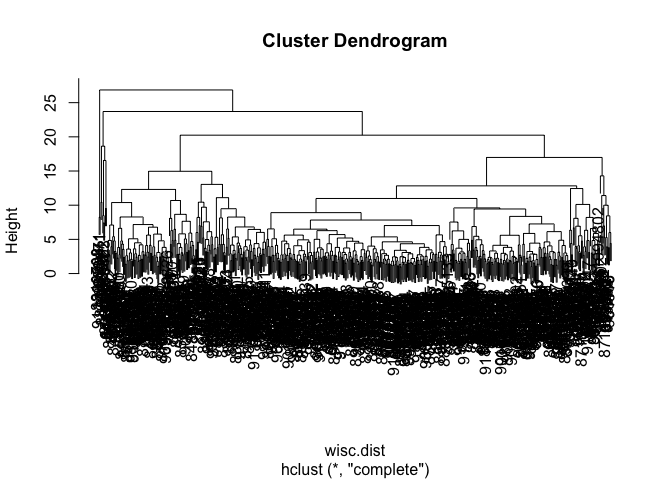
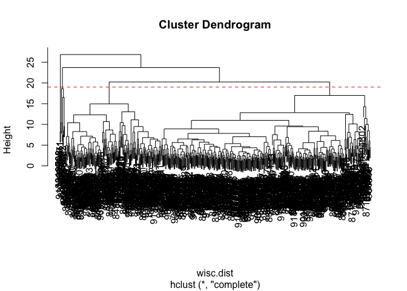
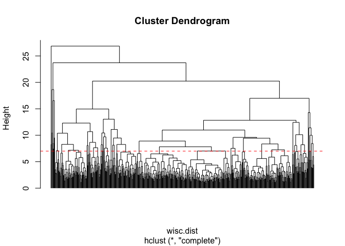

# Class 08: Breast Cancer Mini Project
Yasmeen Al Shakarchi (PID: A18116120)

- [Background](#background)
- [Data Import](#data-import)
- [Principal Component Analysis
  (PCA)](#principal-component-analysis-pca)
  - [Scree plot](#scree-plot)
- [4. Hierarchial clustering](#4-hierarchial-clustering)
- [Combining methods](#combining-methods)
- [Prediction](#prediction)

## Background

In today’s class we will be employing all the R techniques for data
analysis that we have learned thus far for - inlcuding the machine
learning methods of clustering and PCA - to analyze real breast cancer
biopsy

## Data Import

The data is in CSV format:

``` r
wisc.df <- read.csv("WisconsinCancer.csv", row.names = 1)
```

wee peak at the data

``` r
head(wisc.df, 3)
```

             diagnosis radius_mean texture_mean perimeter_mean area_mean
    842302           M       17.99        10.38          122.8      1001
    842517           M       20.57        17.77          132.9      1326
    84300903         M       19.69        21.25          130.0      1203
             smoothness_mean compactness_mean concavity_mean concave.points_mean
    842302           0.11840          0.27760         0.3001             0.14710
    842517           0.08474          0.07864         0.0869             0.07017
    84300903         0.10960          0.15990         0.1974             0.12790
             symmetry_mean fractal_dimension_mean radius_se texture_se perimeter_se
    842302          0.2419                0.07871    1.0950     0.9053        8.589
    842517          0.1812                0.05667    0.5435     0.7339        3.398
    84300903        0.2069                0.05999    0.7456     0.7869        4.585
             area_se smoothness_se compactness_se concavity_se concave.points_se
    842302    153.40      0.006399        0.04904      0.05373           0.01587
    842517     74.08      0.005225        0.01308      0.01860           0.01340
    84300903   94.03      0.006150        0.04006      0.03832           0.02058
             symmetry_se fractal_dimension_se radius_worst texture_worst
    842302       0.03003             0.006193        25.38         17.33
    842517       0.01389             0.003532        24.99         23.41
    84300903     0.02250             0.004571        23.57         25.53
             perimeter_worst area_worst smoothness_worst compactness_worst
    842302             184.6       2019           0.1622            0.6656
    842517             158.8       1956           0.1238            0.1866
    84300903           152.5       1709           0.1444            0.4245
             concavity_worst concave.points_worst symmetry_worst
    842302            0.7119               0.2654         0.4601
    842517            0.2416               0.1860         0.2750
    84300903          0.4504               0.2430         0.3613
             fractal_dimension_worst
    842302                   0.11890
    842517                   0.08902
    84300903                 0.08758

> Q1. How many obervations are in this dataset?

``` r
wisc.data <- wisc.df[,-1]
diagnosis <- wisc.df$diagnosis
```

``` r
nrow(wisc.df)
```

    [1] 569

> Q2. How many of the observations have a malignant diagnosis?

``` r
sum(wisc.df$diagnosis == "M")
```

    [1] 212

``` r
table(wisc.df$diagnosis)
```


      B   M 
    357 212 

> Q3. How many variables/features in the data are suffixed with \_mean?

``` r
length(grep("_mean",colnames(wisc.df)))
```

    [1] 10

``` r
colnames(wisc.df)
```

     [1] "diagnosis"               "radius_mean"            
     [3] "texture_mean"            "perimeter_mean"         
     [5] "area_mean"               "smoothness_mean"        
     [7] "compactness_mean"        "concavity_mean"         
     [9] "concave.points_mean"     "symmetry_mean"          
    [11] "fractal_dimension_mean"  "radius_se"              
    [13] "texture_se"              "perimeter_se"           
    [15] "area_se"                 "smoothness_se"          
    [17] "compactness_se"          "concavity_se"           
    [19] "concave.points_se"       "symmetry_se"            
    [21] "fractal_dimension_se"    "radius_worst"           
    [23] "texture_worst"           "perimeter_worst"        
    [25] "area_worst"              "smoothness_worst"       
    [27] "compactness_worst"       "concavity_worst"        
    [29] "concave.points_worst"    "symmetry_worst"         
    [31] "fractal_dimension_worst"

We need to remove the `dignosis` column before we do any further
analysis of this dataset- we don’t want to pass this to PCA etc. We will
save it as a separate wee vector that we can use later to compare our
findings to those of experts.

``` r
wisc.data <- wisc.df[,-1]
diagnosis <- wisc.df$diagnosis
```

## Principal Component Analysis (PCA)

The main function in base R is called `prcomp()` we will use the
optional argument `scale = TRUE` here as the data
columns/features/dimensions are on very different scales in the original
data set.

``` r
wisc.pr <- prcomp(wisc.data, scale= T)
```

``` r
head(wisc.pr$x)
```

                   PC1        PC2        PC3       PC4        PC5         PC6
    842302   -9.184755  -1.946870 -1.1221788 3.6305364  1.1940595  1.41018364
    842517   -2.385703   3.764859 -0.5288274 1.1172808 -0.6212284  0.02863116
    84300903 -5.728855   1.074229 -0.5512625 0.9112808  0.1769302  0.54097615
    84348301 -7.116691 -10.266556 -3.2299475 0.1524129  2.9582754  3.05073750
    84358402 -3.931842   1.946359  1.3885450 2.9380542 -0.5462667 -1.22541641
    843786   -2.378155  -3.946456 -2.9322967 0.9402096  1.0551135 -0.45064213
                     PC7         PC8         PC9       PC10       PC11       PC12
    842302    2.15747152  0.39805698 -0.15698023 -0.8766305 -0.2627243 -0.8582593
    842517    0.01334635 -0.24077660 -0.71127897  1.1060218 -0.8124048  0.1577838
    84300903 -0.66757908 -0.09728813  0.02404449  0.4538760  0.6050715  0.1242777
    84348301  1.42865363 -1.05863376 -1.40420412 -1.1159933  1.1505012  1.0104267
    84358402 -0.93538950 -0.63581661 -0.26357355  0.3773724 -0.6507870 -0.1104183
    843786    0.49001396  0.16529843 -0.13335576 -0.5299649 -0.1096698  0.0813699
                    PC13         PC14         PC15        PC16        PC17
    842302    0.10329677 -0.690196797  0.601264078  0.74446075 -0.26523740
    842517   -0.94269981 -0.652900844 -0.008966977 -0.64823831 -0.01719707
    84300903 -0.41026561  0.016665095 -0.482994760  0.32482472  0.19075064
    84348301 -0.93245070 -0.486988399  0.168699395  0.05132509  0.48220960
    84358402  0.38760691 -0.538706543 -0.310046684 -0.15247165  0.13302526
    843786   -0.02625135  0.003133944 -0.178447576 -0.01270566  0.19671335
                    PC18       PC19        PC20         PC21        PC22
    842302   -0.54907956  0.1336499  0.34526111  0.096430045 -0.06878939
    842517    0.31801756 -0.2473470 -0.11403274 -0.077259494  0.09449530
    84300903 -0.08789759 -0.3922812 -0.20435242  0.310793246  0.06025601
    84348301 -0.03584323 -0.0267241 -0.46432511  0.433811661  0.20308706
    84358402 -0.01869779  0.4610302  0.06543782 -0.116442469  0.01763433
    843786   -0.29727706 -0.1297265 -0.07117453 -0.002400178  0.10108043
                    PC23         PC24         PC25         PC26        PC27
    842302    0.08444429  0.175102213  0.150887294 -0.201326305 -0.25236294
    842517   -0.21752666 -0.011280193  0.170360355 -0.041092627  0.18111081
    84300903 -0.07422581 -0.102671419 -0.171007656  0.004731249  0.04952586
    84348301 -0.12399554 -0.153294780 -0.077427574 -0.274982822  0.18330078
    84358402  0.13933105  0.005327110 -0.003059371  0.039219780  0.03213957
    843786    0.03344819 -0.002837749 -0.122282765 -0.030272333 -0.08438081
                      PC28         PC29          PC30
    842302   -0.0338846387  0.045607590  0.0471277407
    842517    0.0325955021 -0.005682424  0.0018662342
    84300903  0.0469844833  0.003143131 -0.0007498749
    84348301  0.0424469831 -0.069233868  0.0199198881
    84358402 -0.0347556386  0.005033481 -0.0211951203
    843786    0.0007296587 -0.019703996 -0.0034564331

``` r
library(ggplot2)

ggplot(wisc.pr$x) +
  aes(PC1, PC2, col=diagnosis) +
  geom_point()
```


``` r
summary(wisc.pr)
```

    Importance of components:
                              PC1    PC2     PC3     PC4     PC5     PC6     PC7
    Standard deviation     3.6444 2.3857 1.67867 1.40735 1.28403 1.09880 0.82172
    Proportion of Variance 0.4427 0.1897 0.09393 0.06602 0.05496 0.04025 0.02251
    Cumulative Proportion  0.4427 0.6324 0.72636 0.79239 0.84734 0.88759 0.91010
                               PC8    PC9    PC10   PC11    PC12    PC13    PC14
    Standard deviation     0.69037 0.6457 0.59219 0.5421 0.51104 0.49128 0.39624
    Proportion of Variance 0.01589 0.0139 0.01169 0.0098 0.00871 0.00805 0.00523
    Cumulative Proportion  0.92598 0.9399 0.95157 0.9614 0.97007 0.97812 0.98335
                              PC15    PC16    PC17    PC18    PC19    PC20   PC21
    Standard deviation     0.30681 0.28260 0.24372 0.22939 0.22244 0.17652 0.1731
    Proportion of Variance 0.00314 0.00266 0.00198 0.00175 0.00165 0.00104 0.0010
    Cumulative Proportion  0.98649 0.98915 0.99113 0.99288 0.99453 0.99557 0.9966
                              PC22    PC23   PC24    PC25    PC26    PC27    PC28
    Standard deviation     0.16565 0.15602 0.1344 0.12442 0.09043 0.08307 0.03987
    Proportion of Variance 0.00091 0.00081 0.0006 0.00052 0.00027 0.00023 0.00005
    Cumulative Proportion  0.99749 0.99830 0.9989 0.99942 0.99969 0.99992 0.99997
                              PC29    PC30
    Standard deviation     0.02736 0.01153
    Proportion of Variance 0.00002 0.00000
    Cumulative Proportion  1.00000 1.00000

> Q4. From your results, what proportion of the original variance is
> captured by the first principal component (PC1)?

Answer: 0.4427

> Q5. How many principal components (PCs) are required to describe at
> least 70% of the original variance in the data?

Answer: PC3

> Q6. How many principal components (PCs) are required to describe at
> least 90% of the original variance in the data?

Answer: PC7

> Q7. What stands out to you about this plot? Is it easy or difficult to
> understand? Why?

``` r
biplot(wisc.pr)
```


Answer: This plot is very messy and not easy to read at all. The lines
overlap and it is not comprehensible.

### Scree plot

``` r
pr.var <- wisc.pr$sdev^2
```

``` r
pve <- pr.var / sum(pr.var)

plot(c(1, pve), 
     xlab = "Principal Component", 
     ylab = "Proportion of Variance Explained", 
     ylim = c(0, 1), 
     type = "o")
```


``` r
barplot(pve, ylab = "Percent of Variance Explained",
     names.arg=paste0("PC",1:length(pve)), las=2, axes = FALSE)
axis(2, at=pve, labels=round(pve,2)*100 )
```


``` r
library(factoextra)
```

    Welcome! Want to learn more? See two factoextra-related books at https://goo.gl/ve3WBa

``` r
fviz_eig(wisc.pr, addlabels = TRUE)
```

    Warning in geom_bar(stat = "identity", fill = barfill, color = barcolor, :
    Ignoring empty aesthetic: `width`.


> Q8. Generate a similar plot for principal components 1 and 3. What do
> you notice about these plots?

``` r
library(ggplot2)

ggplot(wisc.pr$x) +
  aes(PC1, PC3, col=diagnosis) +
  geom_point()
```


Answer: The plot is tighter and PC3 explains less variance than PC2
(Less variation).

> Q9. For the first principal component, what is the component of the
> loading vector (i.e. wisc.pr\$rotation\[,1\]) for the feature
> concave.points_mean? This tells us how much this original feature
> contributes to the first PC. Are there any features with larger
> contributions than this one?

``` r
wisc.pr$rotation["concave.points_mean", "PC1"]
```

    [1] -0.2608538

``` r
abs(wisc.pr$rotation[,1])
```

                radius_mean            texture_mean          perimeter_mean 
                 0.21890244              0.10372458              0.22753729 
                  area_mean         smoothness_mean        compactness_mean 
                 0.22099499              0.14258969              0.23928535 
             concavity_mean     concave.points_mean           symmetry_mean 
                 0.25840048              0.26085376              0.13816696 
     fractal_dimension_mean               radius_se              texture_se 
                 0.06436335              0.20597878              0.01742803 
               perimeter_se                 area_se           smoothness_se 
                 0.21132592              0.20286964              0.01453145 
             compactness_se            concavity_se       concave.points_se 
                 0.17039345              0.15358979              0.18341740 
                symmetry_se    fractal_dimension_se            radius_worst 
                 0.04249842              0.10256832              0.22799663 
              texture_worst         perimeter_worst              area_worst 
                 0.10446933              0.23663968              0.22487053 
           smoothness_worst       compactness_worst         concavity_worst 
                 0.12795256              0.21009588              0.22876753 
       concave.points_worst          symmetry_worst fractal_dimension_worst 
                 0.25088597              0.12290456              0.13178394 

Answer: concave.points_mean contributes fairly strongly to PC1 ( neg
(-)), the answer here was –0.2608. Yes lots of others have larger
absolute loadings.

## 4. Hierarchial clustering

The goal of this section is to do heierarchical clustering of the
original data to see if there is any obvious grouping into malignant and
benign clusters.

In short, these results are not good!

First we will scale our `wisc.data` then calculate a distance matrix,
then pass to `hclust()`:

``` r
wisc.dist <- dist( scale(wisc.data))
wisc.hclust <- hclust(wisc.dist)
plot(wisc.hclust)
```



``` r
plot(wisc.hclust)
abline(h = 19, col="red", lty=2)
```



> Q10. Using the plot() and abline() functions, what is the height at
> which the clustering model has 4 clusters?

``` r
plot(wisc.hclust, labels = FALSE, hang = -1, cex = 0.3)
abline(h = 7, col = "red", lty = 2)
```



Answer: At h = 19.

> Q12. Which method gives your favorite results for the same data.dist
> dataset? Explain your reasoning.

Answer: My favorite results come from “average” because

``` r
wisc.hclust.clusters <- cutree(wisc.hclust, k=2)
table(wisc.hclust.clusters)
```

    wisc.hclust.clusters
      1   2 
    567   2 

## Combining methods

The idea here is that I can take my new variables (i.e. the scores on
the pCs `wisc.pr$x`) that are better descriptions of the data-set than
the original features (i.e. the 30 columns in `wisc.data`) and use these
as a basis for clustering.

``` r
pc.dist <- dist(wisc.pr$x[, 1:3])
wisc.pr.hclust <- hclust(pc.dist, method= "ward.D2")
plot(wisc.pr.hclust)
```


``` r
grps <- cutree(wisc.pr.hclust, k=2)
table(grps)
```

    grps
      1   2 
    203 366 

``` r
table(diagnosis)
```

    diagnosis
      B   M 
    357 212 

``` r
wisc.pr.hclust.clusters <- cutree(wisc.pr.hclust, k=2)
```

> Q13. How well does the newly created hclust model with two clusters
> separate out the two “M” and “B” diagnoses?

``` r
table(wisc.pr.hclust.clusters, diagnosis)
```

                           diagnosis
    wisc.pr.hclust.clusters   B   M
                          1  24 179
                          2 333  33

Answer: It clusters it better because there is two clusters separates
the diagnoses ( one fouces on B and other on M).

I can now run `table()` with both my clustering `grps` and the expertn
`diagnosis`

``` r
table(grps, diagnosis)
```

        diagnosis
    grps   B   M
       1  24 179
       2 333  33

Our clustering “1” has 179 “M” diagnosis or cluster “2” has 333 “B”
diagnosis

179 TP 24 FP 333 TN 33 FN

> Q14. How well do the hierarchical clustering models you created in the
> previous sections (i.e. without first doing PCA) do in terms of
> separating the diagnoses? Again, use the table() function to compare
> the output of each model (wisc.hclust.clusters and
> wisc.pr.hclust.clusters) with the vector containing the actual
> diagnoses.

``` r
table(wisc.hclust.clusters, diagnosis)
```

                        diagnosis
    wisc.hclust.clusters   B   M
                       1 357 210
                       2   0   2

``` r
table(wisc.pr.hclust.clusters, diagnosis)
```

                           diagnosis
    wisc.pr.hclust.clusters   B   M
                          1  24 179
                          2 333  33

Answer: The hierarchical clustering model without pr did a poor job
separating the diagnoses ebc ause it mixed both diagnoses toghther.
Where the hierarchical clustering model with pr did a poor job
separating the diagnoses to create two clusters that more clearly
separated benign and malignant samples ( better diagnostic separation).

> Q15. OPTIONAL: Which of your analysis procedures resulted in a
> clustering model with the best specificity? How about sensitivity?

Sensitivity: TP/(TP+FN)

``` r
179/(179+33)
```

    [1] 0.8443396

Specificity: TN/(TN+FP)

``` r
333/(333+24)
```

    [1] 0.9327731

> 

## Prediction

We can use our PCA model for predicition of new un-seen cases:

``` r
url <- "https://tinyurl.com/new-samples-CSV"
new <- read.csv(url)
npc <- predict(wisc.pr, newdata=new)
npc
```

               PC1       PC2        PC3        PC4       PC5        PC6        PC7
    [1,]  2.576616 -3.135913  1.3990492 -0.7631950  2.781648 -0.8150185 -0.3959098
    [2,] -4.754928 -3.009033 -0.1660946 -0.6052952 -1.140698 -1.2189945  0.8193031
                PC8       PC9       PC10      PC11      PC12      PC13     PC14
    [1,] -0.2307350 0.1029569 -0.9272861 0.3411457  0.375921 0.1610764 1.187882
    [2,] -0.3307423 0.5281896 -0.4855301 0.7173233 -1.185917 0.5893856 0.303029
              PC15       PC16        PC17        PC18        PC19       PC20
    [1,] 0.3216974 -0.1743616 -0.07875393 -0.11207028 -0.08802955 -0.2495216
    [2,] 0.1299153  0.1448061 -0.40509706  0.06565549  0.25591230 -0.4289500
               PC21       PC22       PC23       PC24        PC25         PC26
    [1,]  0.1228233 0.09358453 0.08347651  0.1223396  0.02124121  0.078884581
    [2,] -0.1224776 0.01732146 0.06316631 -0.2338618 -0.20755948 -0.009833238
                 PC27        PC28         PC29         PC30
    [1,]  0.220199544 -0.02946023 -0.015620933  0.005269029
    [2,] -0.001134152  0.09638361  0.002795349 -0.019015820

``` r
plot(wisc.pr$x[,1:2], col=grps)
points(npc[,1], npc[,2], col="blue", pch=16, cex=3)
text(npc[,1], npc[,2], c(1,2), col="white")
```


> Q16. Which of these new patients should we prioritize for follow up
> based on your results

Answer: Based on these results the patient that we should prioritize is
patient 2. This is because it is near the black cluster (malignant
samples).
