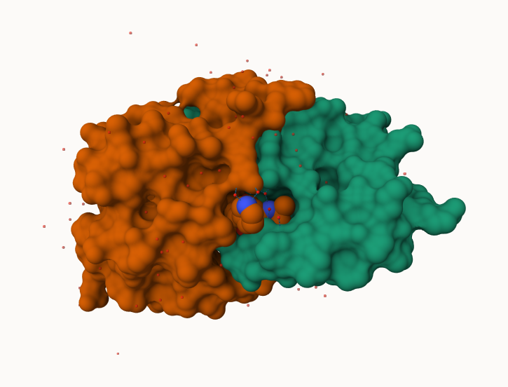
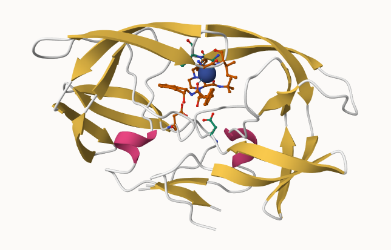

## The PDB database

The [Protein Data Bank (PDB)](http://www.rcsb.org/) is the main repository of biomolecular structure data. Let's see what is in it: 


>Q1: What percentage of structures in the PDB are solved by X-Ray and Electron Microscopy.

Answer: X-ray is 80.9%/ 81%, where EM is 12.8%/ 13%. 

>Q2: What proportion of structures in the PDB are protein?

Answer: 214078 

```{r}
stats <- read.csv("pdbstats26", row.names =1)
stats
```

```{r}
n.sums <- colSums(stats)
n <- n.sums/n.sums["Total"]
round(n, digits = 2)
```

> What is the total number of entries in the PDB?


```{r}
n.sums["Total"]
```

Answer: There is 249018.  


## Using Molstar

We can use the main [Molstar viewer online](https://molstar.org/viewer/):




> Q. Generate and insert an image of the HIV-Pr cartoon colored by secondary structure, showing the inhibitor (ligand) in ball and stick.


> Q. One final image showing catalytic APS 25 and the all-important active site water molecule. 




(Both of these questions is answered from this picture, made sure with the TA)


## The Bio3D package for structural bioinformatiocs

```{r}
library(bio3d)

hiv <- read.pdb("1hsg")
hiv
```


```{r}
head(hiv$atom)
```


```{r}
pdbseq(hiv)
```


Let's try out the new **bio3dview** package that is not yet in CRAN
We can use the **remotes** package to install any R package from GitHub.


### Quick viewing of PDBs


```{r}
library(bio3dview)

#view.pdb(hiv, backgroundColor = "pink")
```

```{r}
library(bio3dview)

sele <- atom.select(hiv, resno=25)

#view.pdb(hiv, backgroundColor = "pink", 
 #        highlight =sele, 
 #        highlight.style = "spacefill")
```


### Predicition of Protein flexibliy


```{r}
adk <- read.pdb("6s36")
m <- nma(adk)
plot(m)
```

In the last plot the highest point sis the most flexible areas.


Write out our results as a wee trajectory movie: 

```{r}
mktrj(m, file="results.pdb")
```


```{r}
#view.nma(m)
```


## Comparative protein structure analysis with PCA

we start with a data base id "1ake_A"

```{r}
library(bio3d)

id <- "1ake_A"
aa <- get.seq("1ake_A")

```

```{r}
aa
```


```{r}
blast <- blast.pdb(aa)
```


Have a wee peak:

```{r}
head( blast$hit.tbl)
```


```{r}
hits <- plot(blast)
```

Peak at our "top hits"

```{r}
head(hits$pdb.id)
```


Now we can download these "top hits" these will all be ADK steuctures in the PDB database. 


```{r}
files <- get.pdb(hits$pdb.id, path="pdbs", split = TRUE, gzip = TRUE)
```


We need one package from BioConductor. To set this up we need to first install a package called **Biocmanager** from CRAN. 

Now we can use the `install()` function from this package like this:
`BiocManager::install("msa")`

```{r}
pdbs <- pdbaln(files, fit = TRUE, exefile="msa")
```


Let's have a wee peak at our stuctures after "fitting" or superposing: 

```{r}
#library(bio3dview)
#view.pdbs(pdbs)
```


```{r}
#view.pdbs(pdbs, colorScheme = "residue")
```


we can run functions like `rmsd()`, `rmsf()` and the best `pca()`


```{r}
pc.xray <- pca(pdbs)
plot(pc.xray)
```


```{r}
plot(pc.xray, 1:2)
```


Finally, let's make a wee movie of the major "motion" or stuructural diffrenece in the dataset- we call this a "trajectory"


```{r}
mktrj(pc.xray, file="results.pdb")
```


