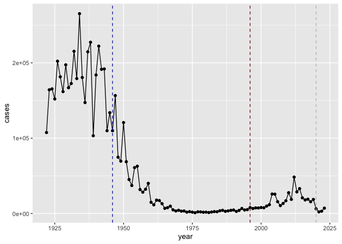
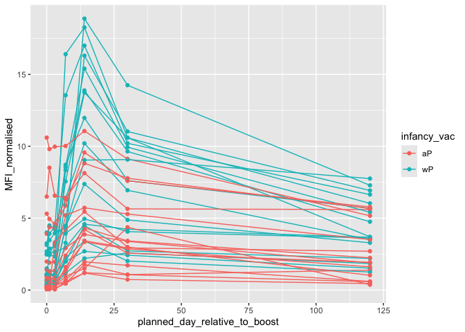
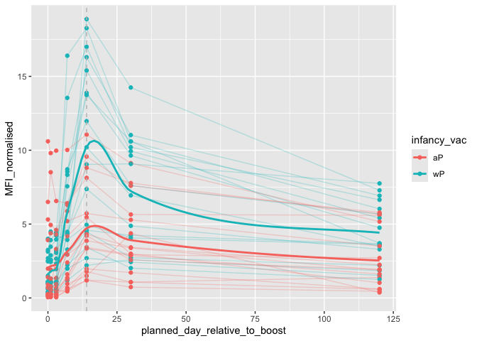

# Class 18
Yasmeen Al Shakarchi (PID: A18116120)

## Background

Pertussis (a.k.a. whooping cough) is a common lung infection caused by
bacteria B. Pertussis.

This can infect all ages but is most sever for those under 1 year of
age.

The CDC track the number of reported cases in US:We can “scrape” this
data with the **datapasta** package

``` r
data <- data.frame(
      stringsAsFactors = FALSE,
           check.names = FALSE,
          `cdc.<-.data.frame(` = c("year = c(","1922L,","1923L,","1924L,","1925L,",
                                   "1926L,","1927L,","1928L,","1929L,",
                                   "1930L,","1931L,","1932L,","1933L,","1934L,",
                                   "1935L,","1936L,","1937L,","1938L,",
                                   "1939L,","1940L,","1941L,","1942L,","1943L,",
                                   "1944L,","1945L,","1946L,","1947L,",
                                   "1948L,","1949L,","1950L,","1951L,","1952L,",
                                   "1953L,","1954L,","1955L,","1956L,",
                                   "1957L,","1958L,","1959L,","1960L,","1961L,",
                                   "1962L,","1963L,","1964L,","1965L,",
                                   "1966L,","1967L,","1968L,","1969L,","1970L,",
                                   "1971L,","1972L,","1973L,","1974L,",
                                   "1975L,","1976L,","1977L,","1978L,","1979L,",
                                   "1980L,","1981L,","1982L,","1983L,",
                                   "1984L,","1985L,","1986L,","1987L,","1988L,",
                                   "1989L,","1990L,","1991L,","1992L,",
                                   "1993L,","1994L,","1995L,","1996L,","1997L,",
                                   "1998L,","1999L,","2000L,","2001L,",
                                   "2002L,","2003L,","2004L,","2005L,","2006L,",
                                   "2007L,","2008L,","2009L,","2010L,",
                                   "2011L,","2012L,","2013L,","2014L,","2015L,",
                                   "2016L,","2017L,","2018L,","2019L,",
                                   "2020L,","2021L,","2022L,","2023L,","2024L,",
                                   "2025L","),","cases = c(","107473,",
                                   "164191,","165418,","152003,","202210,",
                                   "181411,","161799,","197371,","166914,",
                                   "172559,","215343,","179135,","265269,",
                                   "180518,","147237,","214652,","227319,",
                                   "103188,","183866,","222202,","191383,","191890,",
                                   "109873,","133792,","109860,","156517,",
                                   "74715,","69479,","120718,","68687,",
                                   "45030,","37129,","60886,","62786,","31732,",
                                   "28295,","32148,","40005,","14809,",
                                   "11468,","17749,","17135,","13005,","6799,",
                                   "7717,","9718,","4810,","3285,","4249,",
                                   "3036,","3287,","1759,","2402,","1738,",
                                   "1010,","2177,","2063,","1623,","1730,",
                                   "1248,","1895,","2463,","2276,","3589,",
                                   "4195,","2823,","3450,","4157,","4570,",
                                   "2719,","4083,","6586,","4617,","5137,",
                                   "7796,","6564,","7405,","7298,","7867,",
                                   "7580,","9771,","11647,","25827,",
                                   "25616,","15632,","10454,","13278,","16858,",
                                   "27550,","18719,","48277,","28639,",
                                   "32971,","20762,","17972,","18975,","15609,",
                                   "18617,","6124,","2116,","3044,","7063,",
                                   "22538,","21996",")",")")
        )
```

``` r
cdc <- tibble::tribble(
  ~year, ~cases,
  1922, 107473,
  1923, 164191,
  1924, 165418,
  1925, 152003,
  1926, 202210,
  1927, 181411,
  1928, 161799,
  1929, 197371,
  1930, 166914,
  1931, 172559,
  1932, 215343,
  1933, 179135,
  1934, 265269,
  1935, 180518,
  1936, 147237,
  1937, 214652,
  1938, 227319,
  1939, 103188,
  1940, 183866,
  1941, 222202,
  1942, 191383,
  1943, 191890,
  1944, 109873,
  1945, 133792,
  1946, 109860,
  1947, 156517,
  1948, 74715,
  1949, 69479,
  1950, 120718,
  1951, 68687,
  1952, 45030,
  1953, 37129,
  1954, 60886,
  1955, 62786,
  1956, 31732,
  1957, 28295,
  1958, 32148,
  1959, 40005,
  1960, 14809,
  1961, 11468,
  1962, 17749,
  1963, 17135,
  1964, 13005,
  1965, 6799,
  1966, 7717,
  1967, 9718,
  1968, 4810,
  1969, 3285,
  1970, 4249,
  1971, 3036,
  1972, 3287,
  1973, 1759,
  1974, 2402,
  1975, 1738,
  1976, 1010,
  1977, 2177,
  1978, 2063,
  1979, 1623,
  1980, 1730,
  1981, 1248,
  1982, 1895,
  1983, 2463,
  1984, 2276,
  1985, 3589,
  1986, 4195,
  1987, 2823,
  1988, 3450,
  1989, 4157,
  1990, 4570,
  1991, 2719,
  1992, 4083,
  1993, 6586,
  1994, 4617,
  1995, 5137,
  1996, 7796,
  1997, 6564,
  1998, 7405,
  1999, 7298,
  2000, 7867,
  2001, 7580,
  2002, 9771,
  2003, 11647,
  2004, 25827,
  2005, 25616,
  2006, 15632,
  2007, 10454,
  2008, 13278,
  2009, 16858,
  2010, 27550,
  2011, 18719,
  2012, 48277,
  2013, 28639,
  2014, 32971,
  2015, 20762,
  2016, 17972,
  2017, 18975,
  2018, 15609,
  2019, 18617,
  2020, 6124,
  2021, 2116,
  2022, 3044,
  2023, 7063
)
```

> Q1. Make a plot of `year` vs `cases`

``` r
library(ggplot2)
```

``` r
library(ggplot2)

ggplot(cdc) +
  aes(year, cases) +
  geom_point() +
  geom_line()
```


> Q2. Add some major milestones including the first wP vaccine roll-out
> (1946), the switch to the newer aP vaccine (1946), the switch ti the
> newer aP vaccine (1996), the COVID years (2020)

``` r
ggplot(cdc) +
  aes(year, cases) +
  geom_point() +
  geom_line() +
  geom_vline(xintercept = 1946, col= "blue", lty=2) +
  geom_vline(xintercept = 1996, col="darkred", lty=2) +
  geom_vline(xintercept = 2020, col="grey", lty=2)
```



Answer: There were high case numbers in the pre 1940s; then there was a
dramatic drop from of cases that time to the 1960-1970s. At this time it
it contunited to be very small ( or much smaller) amount of cases than
before 1946 /1940s.

> Q3. Describe what happened after happened after the introduction of
> the aP vaccine? Do you have a possible explanation for the observed
> trend?

In the short term, aP was able to combat Pertussis, however the vaccine
was not good at doing this for a long term effect. Which is most likely
what happened and is shown in the data. The immunity from aP decreases
much faster (protection decreases).

**Why is this vaccine-preventable disease on the upswing?** To answer
this question we need to investigate the mechanisms underlying waning
protection against pertussis. This requires evaluation of
pertussis-specific immune responses over time in wP and aP vaccinated
individuals.

## CMI-PB project

[Computational Models of Immunity - Pertussis
Boost](https://www.cmi-pb.org/) project aims to provide the scientific
community with this very information.

They make their data available via JSON format reutrning API. We can
read this in Twith the `read_json` function from the **jsonlite**
package:

``` r
library(jsonlite)

subject <- read_json("https://www.cmi-pb.org/api/subject", simplifyVector = TRUE)

head(subject)
```

      subject_id infancy_vac biological_sex              ethnicity  race
    1          1          wP         Female Not Hispanic or Latino White
    2          2          wP         Female Not Hispanic or Latino White
    3          3          wP         Female                Unknown White
    4          4          wP           Male Not Hispanic or Latino Asian
    5          5          wP           Male Not Hispanic or Latino Asian
    6          6          wP         Female Not Hispanic or Latino White
      year_of_birth date_of_boost      dataset
    1    1986-01-01    2016-09-12 2020_dataset
    2    1968-01-01    2019-01-28 2020_dataset
    3    1983-01-01    2016-10-10 2020_dataset
    4    1988-01-01    2016-08-29 2020_dataset
    5    1991-01-01    2016-08-29 2020_dataset
    6    1988-01-01    2016-10-10 2020_dataset

> Q4. How many aP and wP infancy vaccinated subjects are in the dataset?

``` r
table(subject$infancy_vac)
```


    aP wP 
    87 85 

> Q5. How many Male and Female subjects/patients are in the dataset?

``` r
table(subject$biological_sex)
```


    Female   Male 
       112     60 

WP is higher for on go back!!!!

> Q6. What is the breakdown of race and biological sex (e.g. number of
> Asian females, White males etc..)? (In terms of race and gender is
> this dataset representative of the US population?)

``` r
table(subject$race, subject$biological_sex) 
```

                                               
                                                Female Male
      American Indian/Alaska Native                  0    1
      Asian                                         32   12
      Black or African American                      2    3
      More Than One Race                            15    4
      Native Hawaiian or Other Pacific Islander      1    1
      Unknown or Not Reported                       14    7
      White                                         48   32

Answer: There is 32 Asian females and 12 Asian males, 48 White females
and 32 White males, 2 Black females and 3 Black males. Then there is 0
American Indian/Alaska Native females and 1 American Indian/Alaska
Native male. There is one female and one male Native Hawaiian or Other
Pacific Islander. 15 female and 4 male individuals of More Than One
Race. There are 14 females and 7 males that so not have there race
reported.

Let’s read the next two:

``` r
specimen <- read_json("http://cmi-pb.org/api/v5_1/specimen", simplifyVector = TRUE)

ab_titer <- read_json("http://cmi-pb.org/api/v5_1/plasma_ab_titer", simplifyVector = TRUE)
```

``` r
head(specimen)
```

      specimen_id subject_id actual_day_relative_to_boost
    1           1          1                           -3
    2           2          1                            1
    3           3          1                            3
    4           4          1                            7
    5           5          1                           11
    6           6          1                           32
      planned_day_relative_to_boost specimen_type visit
    1                             0         Blood     1
    2                             1         Blood     2
    3                             3         Blood     3
    4                             7         Blood     4
    5                            14         Blood     5
    6                            30         Blood     6

``` r
head(ab_titer)
```

      specimen_id isotype is_antigen_specific antigen        MFI MFI_normalised
    1           1     IgE               FALSE   Total 1110.21154       2.493425
    2           1     IgE               FALSE   Total 2708.91616       2.493425
    3           1     IgG                TRUE      PT   68.56614       3.736992
    4           1     IgG                TRUE     PRN  332.12718       2.602350
    5           1     IgG                TRUE     FHA 1887.12263      34.050956
    6           1     IgE                TRUE     ACT    0.10000       1.000000
       unit lower_limit_of_detection
    1 UG/ML                 2.096133
    2 IU/ML                29.170000
    3 IU/ML                 0.530000
    4 IU/ML                 6.205949
    5 IU/ML                 4.679535
    6 IU/ML                 2.816431

To analyze this data we need to first “join” (merge/link) the different
tables so we have all the data in one place not spread across different
tables.

We can use the `*_join()` family of functions from **dplyr** to do this

``` r
library(dplyr)
```


    Attaching package: 'dplyr'

    The following objects are masked from 'package:stats':

        filter, lag

    The following objects are masked from 'package:base':

        intersect, setdiff, setequal, union

``` r
meta <- inner_join(subject, specimen)
```

    Joining with `by = join_by(subject_id)`

``` r
head(meta)
```

      subject_id infancy_vac biological_sex              ethnicity  race
    1          1          wP         Female Not Hispanic or Latino White
    2          1          wP         Female Not Hispanic or Latino White
    3          1          wP         Female Not Hispanic or Latino White
    4          1          wP         Female Not Hispanic or Latino White
    5          1          wP         Female Not Hispanic or Latino White
    6          1          wP         Female Not Hispanic or Latino White
      year_of_birth date_of_boost      dataset specimen_id
    1    1986-01-01    2016-09-12 2020_dataset           1
    2    1986-01-01    2016-09-12 2020_dataset           2
    3    1986-01-01    2016-09-12 2020_dataset           3
    4    1986-01-01    2016-09-12 2020_dataset           4
    5    1986-01-01    2016-09-12 2020_dataset           5
    6    1986-01-01    2016-09-12 2020_dataset           6
      actual_day_relative_to_boost planned_day_relative_to_boost specimen_type
    1                           -3                             0         Blood
    2                            1                             1         Blood
    3                            3                             3         Blood
    4                            7                             7         Blood
    5                           11                            14         Blood
    6                           32                            30         Blood
      visit
    1     1
    2     2
    3     3
    4     4
    5     5
    6     6

``` r
abdata <- inner_join(ab_titer, meta)
```

    Joining with `by = join_by(specimen_id)`

``` r
head(abdata)
```

      specimen_id isotype is_antigen_specific antigen        MFI MFI_normalised
    1           1     IgE               FALSE   Total 1110.21154       2.493425
    2           1     IgE               FALSE   Total 2708.91616       2.493425
    3           1     IgG                TRUE      PT   68.56614       3.736992
    4           1     IgG                TRUE     PRN  332.12718       2.602350
    5           1     IgG                TRUE     FHA 1887.12263      34.050956
    6           1     IgE                TRUE     ACT    0.10000       1.000000
       unit lower_limit_of_detection subject_id infancy_vac biological_sex
    1 UG/ML                 2.096133          1          wP         Female
    2 IU/ML                29.170000          1          wP         Female
    3 IU/ML                 0.530000          1          wP         Female
    4 IU/ML                 6.205949          1          wP         Female
    5 IU/ML                 4.679535          1          wP         Female
    6 IU/ML                 2.816431          1          wP         Female
                   ethnicity  race year_of_birth date_of_boost      dataset
    1 Not Hispanic or Latino White    1986-01-01    2016-09-12 2020_dataset
    2 Not Hispanic or Latino White    1986-01-01    2016-09-12 2020_dataset
    3 Not Hispanic or Latino White    1986-01-01    2016-09-12 2020_dataset
    4 Not Hispanic or Latino White    1986-01-01    2016-09-12 2020_dataset
    5 Not Hispanic or Latino White    1986-01-01    2016-09-12 2020_dataset
    6 Not Hispanic or Latino White    1986-01-01    2016-09-12 2020_dataset
      actual_day_relative_to_boost planned_day_relative_to_boost specimen_type
    1                           -3                             0         Blood
    2                           -3                             0         Blood
    3                           -3                             0         Blood
    4                           -3                             0         Blood
    5                           -3                             0         Blood
    6                           -3                             0         Blood
      visit
    1     1
    2     1
    3     1
    4     1
    5     1
    6     1

> Q. What Antibody isotypes are measured for these patients? Q11. How
> many specimens (i.e. entries in abdata) do we have for each isotype?

``` r
table(abdata$isotype)
```


      IgE   IgG  IgG1  IgG2  IgG3  IgG4 
     6698  7265 11993 12000 12000 12000 

Answer: IgE: 6,698 specimens IgG: 7,265 specimens IgG1: 11,993 specimens
IgG2: 12,000 specimens IgG3: 12,000 specimens IgG4: 12,000 specimens

> Q. what antigens are reported? Q12. What are the different \$dataset
> values in abdata and what do you notice about the number of rows for
> the most “recent” dataset?

``` r
table(abdata$antigen)
```


        ACT   BETV1      DT   FELD1     FHA  FIM2/3   LOLP1     LOS Measles     OVA 
       1970    1970    6318    1970    6712    6318    1970    1970    1970    6318 
        PD1     PRN      PT     PTM   Total      TT 
       1970    6712    6712    1970     788    6318 

``` r
table(abdata$dataset)
```


    2020_dataset 2021_dataset 2022_dataset 2023_dataset 
           31520         8085         7301        15050 

Answer: There is 2020_dataset: 31520  
2021_dataset: 8085  
2022_dataset: 7301  
2023_dataset: 15050.

In recent years there is much less rows than in earlier years ( 2020 has
much more than 2023 and 2022). This may show that earlier years had much
more data collected.

Let’s focus on the IgG antigen and make a plot of MFI_normalized for all
antigens.

``` r
igg <- abdata |>
  filter(isotype == "IgG")

head(igg)
```

      specimen_id isotype is_antigen_specific antigen        MFI MFI_normalised
    1           1     IgG                TRUE      PT   68.56614       3.736992
    2           1     IgG                TRUE     PRN  332.12718       2.602350
    3           1     IgG                TRUE     FHA 1887.12263      34.050956
    4          19     IgG                TRUE      PT   20.11607       1.096366
    5          19     IgG                TRUE     PRN  976.67419       7.652635
    6          19     IgG                TRUE     FHA   60.76626       1.096457
       unit lower_limit_of_detection subject_id infancy_vac biological_sex
    1 IU/ML                 0.530000          1          wP         Female
    2 IU/ML                 6.205949          1          wP         Female
    3 IU/ML                 4.679535          1          wP         Female
    4 IU/ML                 0.530000          3          wP         Female
    5 IU/ML                 6.205949          3          wP         Female
    6 IU/ML                 4.679535          3          wP         Female
                   ethnicity  race year_of_birth date_of_boost      dataset
    1 Not Hispanic or Latino White    1986-01-01    2016-09-12 2020_dataset
    2 Not Hispanic or Latino White    1986-01-01    2016-09-12 2020_dataset
    3 Not Hispanic or Latino White    1986-01-01    2016-09-12 2020_dataset
    4                Unknown White    1983-01-01    2016-10-10 2020_dataset
    5                Unknown White    1983-01-01    2016-10-10 2020_dataset
    6                Unknown White    1983-01-01    2016-10-10 2020_dataset
      actual_day_relative_to_boost planned_day_relative_to_boost specimen_type
    1                           -3                             0         Blood
    2                           -3                             0         Blood
    3                           -3                             0         Blood
    4                           -3                             0         Blood
    5                           -3                             0         Blood
    6                           -3                             0         Blood
      visit
    1     1
    2     1
    3     1
    4     1
    5     1
    6     1

``` r
ggplot(igg) +
  aes(MFI_normalised, antigen) +
  geom_boxplot()
```


> Q 13.

``` r
ggplot(igg) +
  aes(MFI_normalised, antigen) +
  geom_boxplot() +
  xlim(0,75) +
  facet_wrap(vars(visit), nrow=2)
```

    Warning: Removed 5 rows containing non-finite outside the scale range
    (`stat_boxplot()`).


> Q. Is there a differenece for aP vs wP indivduals with these values?  

``` r
ggplot(igg) +
  aes(MFI_normalised, antigen) +
  geom_boxplot()
```


``` r
facet_wrap(~infancy_vac)
```

    <ggproto object: Class FacetWrap, Facet, gg>
        attach_axes: function
        attach_strips: function
        compute_layout: function
        draw_back: function
        draw_front: function
        draw_labels: function
        draw_panel_content: function
        draw_panels: function
        finish_data: function
        format_strip_labels: function
        init_gtable: function
        init_scales: function
        map_data: function
        params: list
        set_panel_size: function
        setup_data: function
        setup_panel_params: function
        setup_params: function
        shrink: TRUE
        train_scales: function
        vars: function
        super:  <ggproto object: Class FacetWrap, Facet, gg>

``` r
ggplot(igg) +
  aes(MFI_normalised, antigen, col=infancy_vac) +
  geom_boxplot()
```


> Q. Is there a temprol response - i.e do valus increase our decrease
> over time?

``` r
ggplot(igg) +
  aes(MFI_normalised, antigen, col=infancy_vac) +
geom_boxplot() +
  facet_wrap(~visit)
```


## Focus on “PT” pertussis Toxin antigen

``` r
pt.igg.21 <- igg |> filter(antigen == "PT", 
                           dataset== "2021_dataset")
```

``` r
ggplot(pt.igg.21) +
  aes(planned_day_relative_to_boost, MFI_normalised, 
      col=infancy_vac, 
      group= subject_id) +
  geom_point() +
  geom_line()
```



``` r
geom_vline(xintercept = 14, col="grey", lty=2)
```

    mapping: xintercept = ~xintercept 
    geom_vline: na.rm = FALSE
    stat_identity: na.rm = FALSE
    position_identity 

``` r
ggplot(pt.igg.21) +
  aes(planned_day_relative_to_boost, MFI_normalised, 
      col = infancy_vac, 
      group = subject_id) +
  geom_point() +
  geom_line(alpha=0.25) +
  geom_vline(xintercept = 14, col = "grey", lty = 2) +
  geom_smooth(aes(col=infancy_vac, group=NULL),
    method = "loess",
    se = FALSE, span=0.4
  )
```

    `geom_smooth()` using formula = 'y ~ x'


