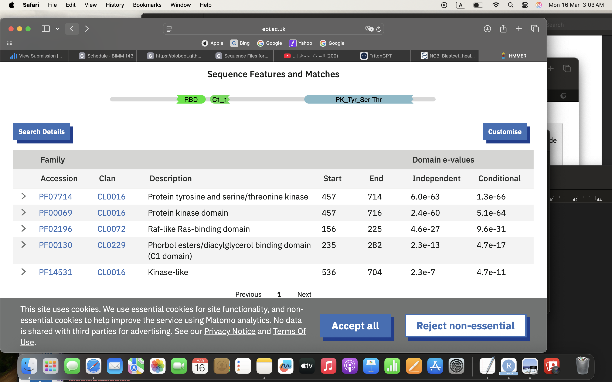

I downloaded my sequences and moved them to my working project directory.

I ran a BLASTp search against REFSEQ_PROTEIN filtered to human only. JOBID: VFJ13ST2016


Official Symbol:
**BRAF**
Official Full Name:
**serine/threonine‑protein kinase B‑raf**


>Q2. What are the tumor specific mutations in this particular case ( e.g. A130V)?


```{r}
library(bio3d)

# Read my sequences
a <- read.fasta("A18116120_mutant_seq.fa")

```


We cab score conservation per sequnce position

```{r}
s <- conserv(a)
mutation.position <- which( s !=1)
mutation.position
```


```{r}
a$ali[1,mutation.position]
mutation.position
a$ali[2, mutation.position]
```

Answer: it seems for the code above that it will be F548V, S605E, L613R, L618Y


What PFAM domain do these mutation reside in?

We can use HMMER at the EBI (it works) to find this information 

Answer: C‑terminal region (residues ~457–716) corresponds to the protein kinase domain (F548V, S605E, L613R, L618Yfall within these domains). 
Not a single domian, but multi‑domain protein.
PFAM ID: PF07714
Domain name: Protein tyrosine and serine/threonine kinase (Pkinase)

```{r}

```

> Q4. Using the NCI-GDC list the observed top 2 missense mutations in this protein (amino acid substitutions)?

Top 2 most common missense mutations in BRAF (NCI‑GDC):

V640E and V640M


>Q5. What two TCGA projects have the most cases affected by mutations of this gene? (Give the TCGA “code” and “Project Name” for example “TCGA-BRCA” and “Breast Invasive Carcinoma”).


Answer: 
TCGA‑THCA — Thyroid Carcinoma AND TCGA‑SKCM — Skin Cutaneous Melanoma


>Q6.List one RCSB PDB identifier with 100% identity to the wt_healthy sequence and detail the percent coverage of your query sequence for this known structure? Alternately,provide the most similar in sequence PDB structure along with it’s percent identity, coverage and E-value. Does this structure “cover” (i.e. include or span the amino acid residue positions) of your previously identified tumor specific mutations?


Answer: 

Chain A, Serine/threonine-protein kinase B-raf [Homo sapiens]

PDB ID: 6QOK, chain A
Percent identity: 99.87%
Query coverage: 100%
E‑value: 0.0


It was found that this structure corresponds to the BRAF kinase domain (residues ~457–717) and has all F548V, S605E, L613R, L618Y ( does cover all of the mutation positions.)


